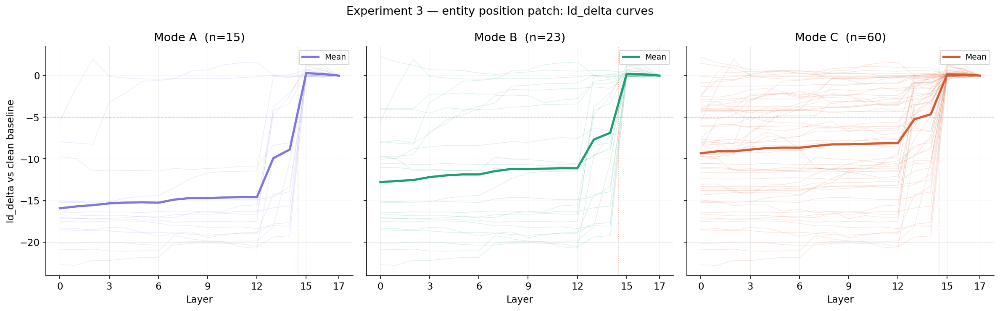
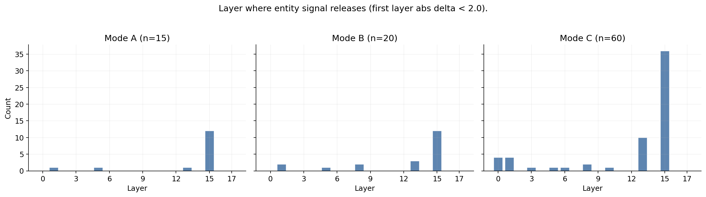
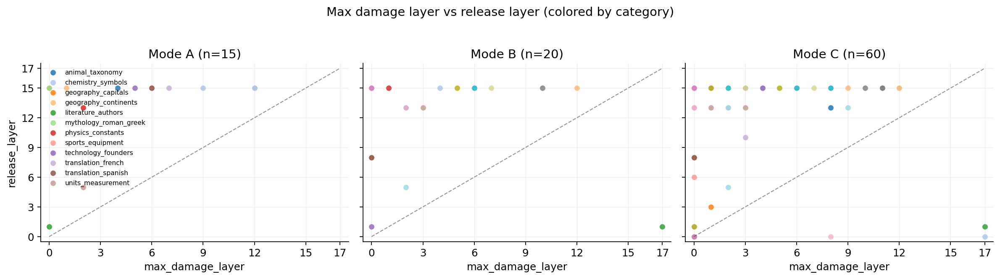
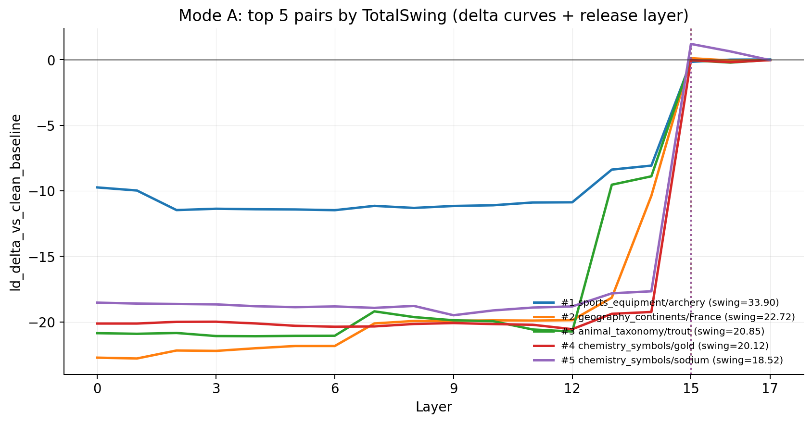
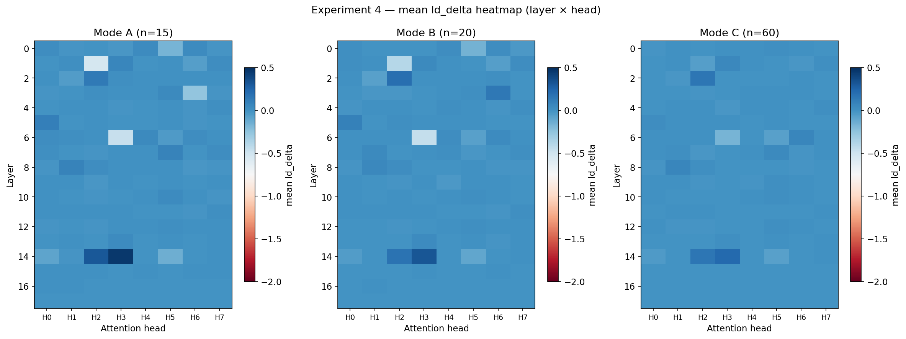
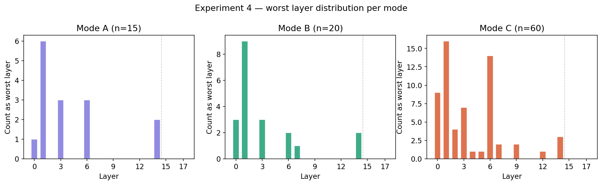
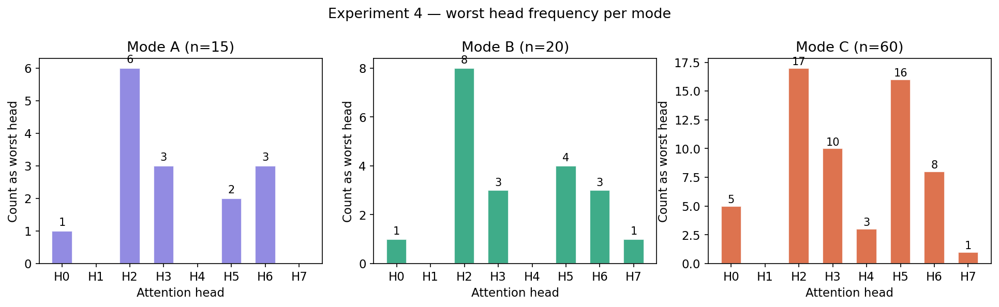

# Bizarro World: Fact-retrieval circuits in Gemma 2B

## Abstract

This repository supports **mechanistic interpretability** work on **`google/gemma-2b`** with **TransformerLens**. The goal is to **map fact-related computation**: identify parts of the network whose activations support correct next-token predictions on simple, high-coverage factual prompts, using **activation patching** (causal tracing) under **controlled contrasts**.

All contrasts use **structurally aligned prompt pairs** so that observed differences are easier to tie to **internal representations** instead of length, punctuation, or tokenizer quirks. The stack is meant to run reliably on **university HPC** (Slurm, gated Hugging Face weights, tight disk quotas), with metrics that stay numerically sane under **fp16** inference over a large vocabulary.

---

## The “Bizarro” methodology (core pivot)

### What we moved away from

An older idea was that “Bizarro” should show up **in the prompt text**—long, whimsical counterfactuals (e.g. alternate physics spelled out in prose). That is fine for **behavioral** demos of in-context override, but it is a **weak** setup for **circuit discovery**: too many moving parts, and hard to align positions across runs.

### What we standardize on

In this project, the important contrast lives **in the model’s internal states**, not in baroque surface text.

1. **Clean run** — A short, ordinary factual stem (e.g. *The capital of France is* → **Paris**).

2. **Corrupt run (aligned)** — The **same template**, same role slots, **same token length under Gemma**, with only the **entity** swapped (e.g. *The capital of Spain is* → **Madrid**).

3. **“Bizarro” as patching, not prose** — We treat “Bizarro” as: **keep a clean forward pass as reference**, then **patch activations** from the corrupt forward into the clean run’s **residual stream** (or chosen submodules) and read off logit changes. The prompts stay **boring and factual**; the forced “wrong world” is **mechanical**.

### Why alignment matters

Patching needs **position-to-position** correspondence. If clean and corrupt strings differ in **token count** or **syntax**, hidden-state differences mix **meaning**, **position**, and **tokenizer noise**. This repo therefore enforces:

- **Matched prompt tokenization** (checked when you run the driver).
- **Single-token continuation targets** (usually with a **leading space**, SentencePiece-style), so each probability is a single scalar index into the next-token distribution.

### Why we do not rely on “story override” prompts for circuits

Narrative overrides can move the distribution through **shallow completion** paths without telling you **which components** stored the fact. Aligned factual pairs keep the **task** fixed (capitals, symbols, units, …) and change only the **binding** (France vs Spain). That improves **signal-to-noise** for later patching: you intervene on a **matched scaffold**, which is the usual standard in careful activation work.

---

## Experimental pipeline

### Phase 1 — Fact battery

Data live in **`fact_battery.json`**: a JSON array of objects with:

- `category`
- `clean_prompt` / `corrupt_prompt` (token-length matched for Gemma)
- `clean_target` / `corrupt_target` (each a **single** tokenizer token)

There are **20** thematic buckets × **3** pairs each (**60** rows). Editing the JSON changes experiments without editing Python.

### Phase 2 — Baseline evaluation (behavioral / patching triage)

The script **`behavioral_friction_gemma2b.py`** loads the model and, for **each** row, reads **raw next-token logits** at the **final** prompt position for both `clean_target` and `corrupt_target` token ids.

**Bidirectional logit difference (patching-style).** On each forward, define  
`LD = logit(clean_target) - logit(corrupt_target)` (computed in **fp32** on the logit vector).

- **`LD_clean`** — forward on the **clean** prompt. When the model “locks in” the clean fact, the clean token should beat the corrupt token: **large positive** `LD_clean`.
- **`LD_corrupt`** — forward on the **corrupt** prompt with the **same two token ids**. The corrupt token should win: `logit(corrupt) > logit(clean)`, so **large negative** `LD_corrupt` (because `LD` is still *clean minus corrupt*).

**TotalSwing (golden-pair screen).**  
`TotalSwing = LD_clean - LD_corrupt`.  
Subtracting a negative `LD_corrupt` **adds** magnitude when both legs are strong. Intuitively: you reward **both** a decisive clean-side margin *and* a decisive corrupt-side margin—the same two-token race **reverses** across the two aligned contexts. **Larger TotalSwing ⇒ better “golden pair”** for downstream activation patching (high signal before any hooks run).

**Sanity probabilities.** The console table and CSV include **`P(clean_target | clean_prompt)`** and **`P(corrupt_target | corrupt_prompt)`** from **softmax in fp32** (marginal checks that each world is confidently answered).

**Outputs.**

- **Console table** — sorted by **TotalSwing** descending. Columns: `rank`, `idx` (0-based row in `fact_battery.json`), `TotalSwing`, `LD_clean`, `LD_corrupt`, `P_clean`, `P_corrupt`, `category`, and a truncated `clean_prompt|corrupt_prompt` prefix.
- **`fact_battery_triage.csv`** — same sort order; full prompts and targets; numeric columns as strings with fixed precision for clean import into pandas or Sheets. Regenerated on every script run (listed in `.gitignore` so local runs do not dirty the tree unless you remove that line).

**Numerical stability.** Logit differences and softmax use **fp32** math on the last-position logit vector so large-vocabulary **fp16** runs are less likely to produce garbage probabilities for triage.

### Phase 3 — Activation patching (causal tracing)

Use **high TotalSwing** pairs from Phase 2 as **priority** for interventions. The implementation lives in **`scripts/experiments/exp1.py`** (Slurm: **`slurm/run_exp1.slurm`**), using **TransformerLens** hooks and the fact battery’s aligned counterfactuals.

- Cache activations on **clean** vs **corrupt** forwards.
- Patch **position-aligned** residual (or attention / MLP) components from corrupt into clean.
- Attribute **logit shifts** on the clean-vs-corrupt margin to **layers** (and, in later work, heads and sublayers).

---

## Experimentation and Future Steps

This project is a **mechanistic interpretability** investigation into how **Gemma 2B** encodes and retrieves factual knowledge, with **activation patching** as the primary surgical tool. It begins with a **fact battery** of **60** prompt pairs spanning **20** categories (geography, chemistry, anatomy, sports, mythology, and more). Each pair is **structurally matched** so that only the factual binding changes while syntax and token length stay aligned under Gemma—reducing confounds from length, punctuation, and tokenizer quirks.

### Behavioral triage and golden-pair selection

Phase 2 scores every pair with a **bidirectional logit-difference** setup. On each forward pass at the **final** prompt position we define:

`LD = logit(clean_target) − logit(corrupt_target)` (same two token ids on both prompts).

- **`LD_clean`** — evaluated on the **clean** prompt (we want a **large positive** margin when the model prefers the clean completion).
- **`LD_corrupt`** — evaluated on the **corrupt** prompt (we want a **large negative** margin when the model prefers the corrupt completion).

**TotalSwing** is **`LD_clean − LD_corrupt`**. We treat this as a strong screening metric for patching: it rewards a **two-horse logit race** that **reverses** across the two aligned contexts, rather than relying on a single raw probability that can be fragile under tokenization ambiguity or synonym competition.

From the ranked triage export (**`fact_battery_triage.csv`**) we support three **golden-pair selection modes** via **`golden_pairs.select_golden_pairs`**:

| Mode | Selection rule |
|------|----------------|
| **A** | Top **15** globally by TotalSwing |
| **B** | Best **per category** (one strongest pair per bucket) |
| **C** | **All 60** pairs (full battery) |

Together, these modes support **robustness checks** across selection strategies (high-signal subset vs category coverage vs exhaustive sweep).

### Experiment 1 — Residual stream patching sweep

**Experiment 1** runs a **layerwise residual** intervention: for each golden pair, cache the corrupt forward, then for each transformer block replace **`hook_resid_pre` at the final sequence position** in the **clean** run with the corresponding cached vector from the corrupt run, and measure damage to the clean **logit margin** (the same LD definition as in triage). The per-layer effect relative to the unpatched clean run is recorded as **`ld_delta_vs_clean_baseline_by_layer`**.

**Finding (consistent across modes).** Across **95** prompt-pair runs in aggregate across modes A, B, and C (**15 + 20 + 60**), worst-case damage concentrates in the **last few blocks**: layers **15**, **16**, and **17** (with **layer 17** dominating), rather than spreading uniformly across depth. Mean **`worst_layer_min_delta`** is stable across selection modes—approximately **16.27** (A), **16.40** (B), and **16.32** (C)—which is the kind of stability you expect when an effect tracks **architecture** more than a cherry-picked subset.

**Correlation with confidence.** Patching damage (minimum \(\Delta\)LD vs clean baseline across layers) correlates strongly with **baseline conviction on the clean margin** (**`baseline_ld_clean`**): **Pearson** **r ≈ −0.794** (**p ≈ 0.0004**) in Mode A; **r ≈ −0.870** (**p < 0.0001**) in Mode B; **r ≈ −0.832** (**p < 0.0001**) in Mode C. Stronger clean-side margins tend to co-occur with **more catastrophic** interventions when late residual state is replaced—consistent with a **late-stage readout** story, with the usual caveat that this experiment patches **only the final token position** at **`resid_pre`**.

Analysis helpers: **`notebooks/experiment1_analysis.ipynb`**, **`scripts/data_analysis/analysis.py`**, and **`scripts/data_analysis/exp1_data_analysis.py`** (figures under **`outputs/`** or **`notebooks/outputs/`** depending on run configuration).

### Experiment 2 — Attention vs MLP decomposition (2A final, 2B entity)

Experiment 2 decomposes the residual stream into five standard hook points:
`hook_resid_pre`, `hook_attn_out`, `hook_resid_mid`, `hook_mlp_out`, `hook_resid_post`.
In both parts we patch **cached corrupt activations** into the **clean** run and measure damage to the clean LD margin (same metric as Experiment 1/3).

- **Experiment 2A (final token, all 18 layers × 5 hooks)**: decompose the **final token position** across layers **0–17**. Entry point: `scripts/experiments/exp2a.py`.
- **Experiment 2B (entity token, all 18 layers × 5 hooks)**: identical decomposition, but patch at the **entity token position** across layers **0–17**. Entry point: `scripts/experiments/exp2b.py`.

**Finding (core mechanism).** Both the entity position and the final position are governed by the same mechanism: **residual-stream-first**, with attention and MLP contributing minimally and intermittently. The factual signal is carried **passively** by the accumulating residual stream at both ends of the circuit. Neither end involves active discrete computation — the transformer is functioning as a **signal carrier**, not a **signal processor**, for this task.

### Experiment 3 — Where the fact “lives” before it becomes load-bearing

**Experiment 3** repeats the layer sweep but patches at the **entity token position** (same `hook_resid_pre`, but at `entity_position` instead of the final token). This separates **where the factual identity is represented** (entity position early) from **where it becomes load-bearing** (final position late).

**Finding (clear across modes).** Entity-position patch damage is **large early** (layers 0–14) and then **releases sharply** around **layers 13–15**, i.e., the entity-local representation stops being “damageable” as the information is routed away toward the answer position.
| Entity-position sweep (A/B/C) | Release + alignment diagnostics |
|---|---|
|  |  |

Additional supporting views:
| Max-damage vs release layer | Mode A top-5 delta curves (with release lines) |
|---|---|
|  |  |

### Experiment 4 — Which attention head routes entity → answer?

**Experiment 4** holds everything fixed from Experiment 3 (same pairs, same entity-position lookup, same LD damage metric) but changes the hook point to attention’s **routing primitive**: patch **one head at a time** at **`blocks.{L}.attn.hook_z`** at the **entity token position**. The output per pair is an **18×8 heatmap** of `ld_delta` values (layers × heads), plus the worst (layer, head) cell.

**Finding (high-level).** The damage is sparse: most (layer, head) interventions are near zero, with a small number of hot cells that nominate specific heads/layers as candidate **fact-routing circuits**.
| Mean heatmap (aggregate) | Worst-layer distribution | Worst-head frequency |
|---|---|---|
|  |  |  |

### Future work

- **Sublayer decomposition in the critical blocks** — With layers **15–17** implicated at the **final** position, the next phase **separates attention output vs MLP output** (and related hooks) to see which sublayer “commits” the answer.
- **Non-final positions** — Extend patching to **entity / span positions**, not only the last token, to separate **where information is accumulated** from **where it is read out** into logits.
- **Sparse autoencoders** — Apply **Gemma Scope** (or comparable) SAEs to late-layer vectors to identify interpretable features that flip between clean and corrupt worlds.
- **Cross-architecture replication** — Repeat the protocol on **LLaMA**, **Mistral**, **Qwen**, **DeepSeek**, etc., to test whether **late-layer commitment** is Gemma-specific or a broader transformer signature. If it holds, the result is worth writing up with care.

---

## ML systems engineering (infrastructure)

Even at **2B** parameters, weights, caches, and optional activation stores add up. This repo assumes **cluster** workflows:

- **Slurm** — Request **GPU**, enough **CPU RAM** (model shard load can spike), and realistic **walltime**. Preempt queues are OK for dev if you checkpoint logs.
- **Disk** — Point **`HF_HOME`** (or equivalent) at **scratch** or project space when home quotas are small (~tens of GB).
- **Containers** — NGC / Singularity wrappers sometimes **drop** env vars. For gated models you may need **`SINGULARITYENV_HF_TOKEN`**, **`huggingface-cli login`**, or site docs. Never commit tokens.
- **VRAM vs metrics** — Forwards often stay in **fp16**; triage metrics read logits / softmax in **fp32** to avoid silent **NaN** or collapsed probabilities at the reporting step.

**Run Phase 1–2:**

```bash
python behavioral_friction_gemma2b.py
```

Keep **`fact_battery.json`** next to that file (same folder), or pass a path into **`load_fact_battery(...)`** from your own code.

---

## Repository layout

| Path | Role |
|------|------|
| `fact_battery.json` | Aligned prompt pairs (Phase 1 data). |
| `behavioral_friction_gemma2b.py` | Load model, validate pairs, bidirectional **logit-difference** triage, **TotalSwing-ranked** console table + **`fact_battery_triage.csv`**. |
| `fact_battery_triage.csv` | **Generated** triage export (same directory as the script; gitignored by default). |
| `golden_pairs.py` | Read triage CSV; select golden pairs for **modes A / B / C**. |
| `scripts/experiments/exp1.py` | **Experiment 1**: layerwise **`resid_pre`** patching at the **final** position; writes **`experiment_{mode}.json`**. |
| `scripts/experiments/exp2a.py` | **Experiment 2A**: attention vs MLP decomposition (layers 15–17, final token). Writes `experiment2a_{MODE}.json` + `experiment2a_{MODE}.log`. |
| `scripts/experiments/exp2b.py` | **Experiment 2B**: attention vs MLP decomposition (all layers, entity token). Writes `experiment2b_{MODE}.json` + `experiment2b_{MODE}.log`. |
| `scripts/experiments/exp3.py` | **Experiment 3**: entity-position patching (hook_resid_pre, full layer sweep). Writes `experiment3_{MODE}.json` + `experiment3_{MODE}.log`. |
| `scripts/experiments/exp4.py` | **Experiment 4**: headwise `hook_z` patching at the **entity** position (18×8 sweep). Writes `experiment4_{MODE}.json` + `experiment4_{MODE}.log`. |
| `slurm/run_experiment.slurm` | Unified Slurm runner. Pass `MODE`, `OUTDIR`, and `SCRIPT` via `--export`. |
| `scripts/data_analysis/analysis.py` | Triage / probability audits on experiment JSON. |
| `scripts/data_analysis/exp1_data_analysis.py` | Figures and summaries for Experiment 1 outputs. |
| `scripts/data_analysis/exp3_drop_analysis.py` | Drop/release-layer analysis and figures for Experiment 3 entity-position deltas. |
| `scripts/data_prep/add_entity_tokens.py` | Add `entity_token` to `fact_battery.json` (required by Experiment 3). |
| `scripts/data_prep/validate_fact_battery.py` | Offline checks for token alignment and single-token targets. |
| `notebooks/experiment1_analysis.ipynb` | Pooled analysis for **`experiment_A/B/C.json`** (figures + correlations). |
| `experiment1_pooled/` | Optional directory for symlinks or copies of all three experiment JSONs (used by the notebook). |
| `behavioral_friction_gemma2b_colab.ipynb` | Optional Colab-oriented notes (legacy / exploratory). |

---

## References (pointers)

Mechanistic interpretability and activation patching connect to **causal scrubbing**, **path patching**, and **attribution-style** analyses; Anthropic and NEEL-style writeups are good entry points. Claims in this repo are intentionally **modest** and **replication-oriented**—the tables are for **screening**, not for publishing conclusions by themselves.
