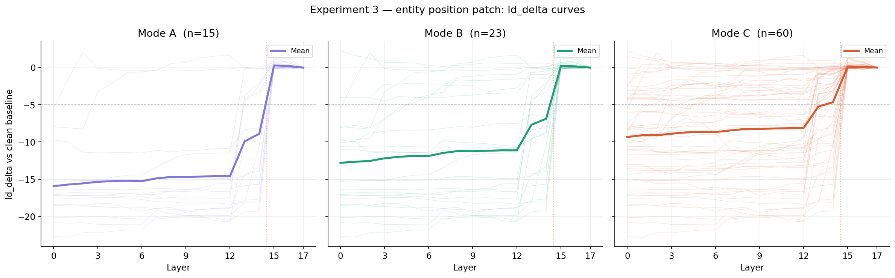
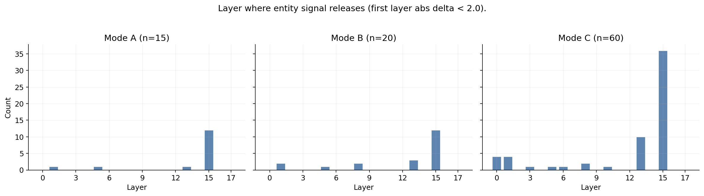
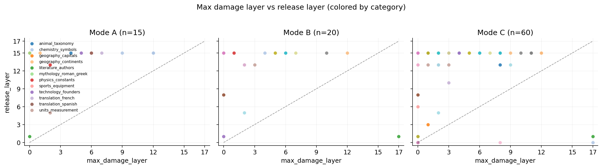
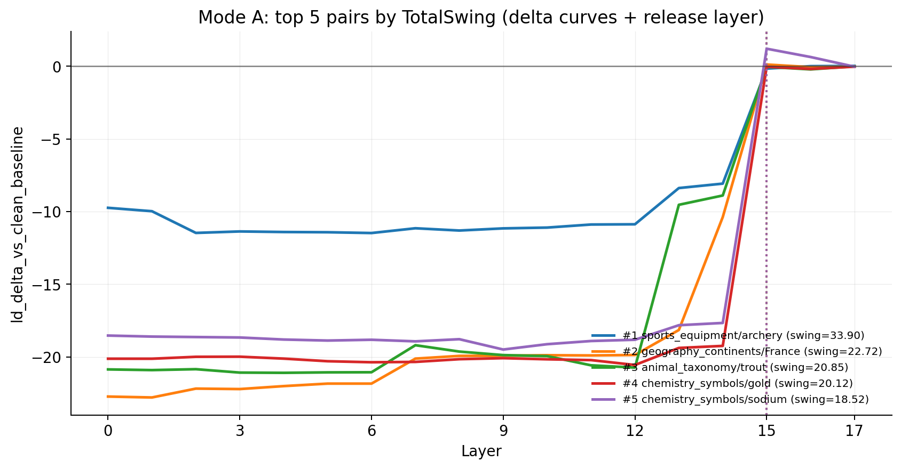
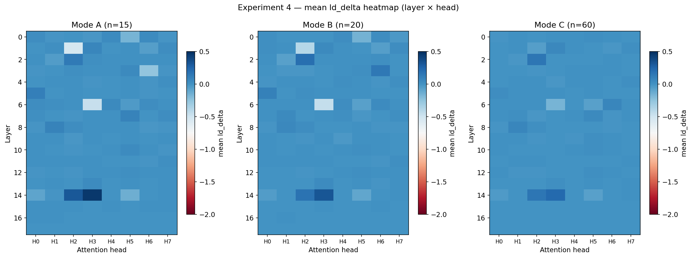
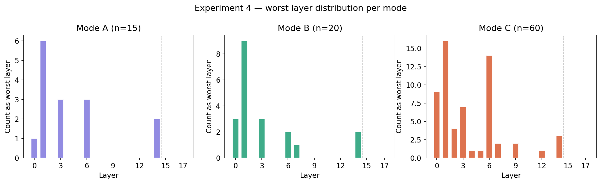
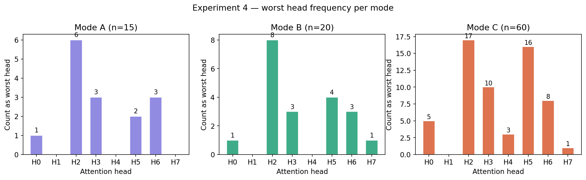

# Bizarro World: Fact-retrieval circuits (multi-model)

## Abstract

This repository supports **mechanistic interpretability** work—primarily on **`google/gemma-2b`** with **TransformerLens**, with a parallel path for **`meta-llama/Meta-Llama-3-70B`** (8-bit via Hugging Face + bitsandbytes). The goal is to **map fact-related computation**: identify parts of the network whose activations support correct next-token predictions on simple, high-coverage factual prompts, using **activation patching** (causal tracing) under **controlled contrasts**.

All contrasts use **structurally aligned prompt pairs** so that observed differences are easier to tie to **internal representations** instead of length, punctuation, or tokenizer quirks. The stack is meant to run reliably on **university HPC** (Slurm, gated Hugging Face weights, tight disk quotas), with metrics that stay numerically sane under **fp16** inference over a large vocabulary.

---

## The “Bizarro” methodology (core pivot)

### What we moved away from

An older idea was that “Bizarro” should show up **in the prompt text**—long, whimsical counterfactuals (e.g. alternate physics spelled out in prose). That is fine for **behavioral** demos of in-context override, but it is a **weak** setup for **circuit discovery**: too many moving parts, and hard to align positions across runs.

### What we standardize on

In this project, the important contrast lives **in the model’s internal states**, not in baroque surface text.

1. **Clean run** — A short, ordinary factual stem (e.g. *The capital of France is* → **Paris**).

2. **Corrupt run (aligned)** — The **same template**, same role slots, **same token length under Gemma**, with only the **entity** swapped (e.g. *The capital of Spain is* → **Madrid**).

3. **“Bizarro” as patching, not prose** — We treat “Bizarro” as: **keep a clean forward pass as reference**, then **patch activations** from the corrupt forward into the clean run’s **residual stream** (or chosen submodules) and read off logit changes. The prompts stay **boring and factual**; the forced “wrong world” is **mechanical**.

### Why alignment matters

Patching needs **position-to-position** correspondence. If clean and corrupt strings differ in **token count** or **syntax**, hidden-state differences mix **meaning**, **position**, and **tokenizer noise**. This repo therefore enforces:

- **Matched prompt tokenization** (checked when you run the driver).
- **Single-token continuation targets** (usually with a **leading space**, SentencePiece-style), so each probability is a single scalar index into the next-token distribution.

### Why we do not rely on “story override” prompts for circuits

Narrative overrides can move the distribution through **shallow completion** paths without telling you **which components** stored the fact. Aligned factual pairs keep the **task** fixed (capitals, symbols, units, …) and change only the **binding** (France vs Spain). That improves **signal-to-noise** for later patching: you intervene on a **matched scaffold**, which is the usual standard in careful activation work.

---

## Experimental pipeline

### Phase 1 — Fact battery

Data live in **`fact_battery/gemma-2b.json`**: a JSON array of objects with:

- `category`
- `clean_prompt` / `corrupt_prompt` (token-length matched for Gemma)
- `clean_target` / `corrupt_target` (each a **single** tokenizer token)

There are **20** thematic buckets × **3** pairs each (**60** rows). Editing the JSON changes experiments without editing Python.

### Phase 2 — Baseline evaluation (behavioral / patching triage)

The script **`gemma-2b/drivers/behavioral_friction_gemma2b.py`** loads the model and, for **each** row, reads **raw next-token logits** at the **final** prompt position for both `clean_target` and `corrupt_target` token ids.

**Bidirectional logit difference (patching-style).** On each forward, define  
`LD = logit(clean_target) - logit(corrupt_target)` (computed in **fp32** on the logit vector).

- **`LD_clean`** — forward on the **clean** prompt. When the model “locks in” the clean fact, the clean token should beat the corrupt token: **large positive** `LD_clean`.
- **`LD_corrupt`** — forward on the **corrupt** prompt with the **same two token ids**. The corrupt token should win: `logit(corrupt) > logit(clean)`, so **large negative** `LD_corrupt` (because `LD` is still *clean minus corrupt*).

**TotalSwing (golden-pair screen).**  
`TotalSwing = LD_clean - LD_corrupt`.  
Subtracting a negative `LD_corrupt` **adds** magnitude when both legs are strong. Intuitively: you reward **both** a decisive clean-side margin *and* a decisive corrupt-side margin—the same two-token race **reverses** across the two aligned contexts. **Larger TotalSwing ⇒ better “golden pair”** for downstream activation patching (high signal before any hooks run).

**Sanity probabilities.** The console table and CSV include **`P(clean_target | clean_prompt)`** and **`P(corrupt_target | corrupt_prompt)`** from **softmax in fp32** (marginal checks that each world is confidently answered).

**Outputs.**

- **Console table** — sorted by **TotalSwing** descending. Columns: `rank`, `idx` (0-based row in `fact_battery/gemma-2b.json`), `TotalSwing`, `LD_clean`, `LD_corrupt`, `P_clean`, `P_corrupt`, `category`, and a truncated `clean_prompt|corrupt_prompt` prefix.
- **`gemma-2b/triage/fact_battery_triage.csv`** — same sort order; full prompts and targets; numeric columns as strings with fixed precision for clean import into pandas or Sheets. Regenerated on every script run (listed in `.gitignore` so local runs do not dirty the tree unless you remove that line).

**Numerical stability.** Logit differences and softmax use **fp32** math on the last-position logit vector so large-vocabulary **fp16** runs are less likely to produce garbage probabilities for triage.

### Phase 3 — Activation patching (causal tracing)

Use **high TotalSwing** pairs from Phase 2 as **priority** for interventions. The implementation lives in **`scripts/experiments/exp1.py`** (Slurm: **`slurm/run_experiment.slurm`**), using **TransformerLens** hooks and the fact battery’s aligned counterfactuals.

- Cache activations on **clean** vs **corrupt** forwards.
- Patch **position-aligned** residual (or attention / MLP) components from corrupt into clean.
- Attribute **logit shifts** on the clean-vs-corrupt margin to **layers** (and, in later work, heads and sublayers).

---

## Experimentation and Future Steps

This project is a **mechanistic interpretability** investigation into how **Gemma 2B** encodes and retrieves factual knowledge, with **activation patching** as the primary surgical tool. It begins with a **fact battery** of **60** prompt pairs spanning **20** categories (geography, chemistry, anatomy, sports, mythology, and more). Each pair is **structurally matched** so that only the factual binding changes while syntax and token length stay aligned under Gemma—reducing confounds from length, punctuation, and tokenizer quirks.

### Behavioral triage and golden-pair selection

Phase 2 scores every pair with a **bidirectional logit-difference** setup. On each forward pass at the **final** prompt position we define:

`LD = logit(clean_target) − logit(corrupt_target)` (same two token ids on both prompts).

- **`LD_clean`** — evaluated on the **clean** prompt (we want a **large positive** margin when the model prefers the clean completion).
- **`LD_corrupt`** — evaluated on the **corrupt** prompt (we want a **large negative** margin when the model prefers the corrupt completion).

**TotalSwing** is **`LD_clean − LD_corrupt`**. We treat this as a strong screening metric for patching: it rewards a **two-horse logit race** that **reverses** across the two aligned contexts, rather than relying on a single raw probability that can be fragile under tokenization ambiguity or synonym competition.

From the ranked triage export (**`gemma-2b/triage/fact_battery_triage.csv`**) we support three **golden-pair selection modes** via **`golden_pairs.select_golden_pairs`**:

| Mode | Selection rule |
|------|----------------|
| **A** | Top **15** globally by TotalSwing |
| **B** | Best **per category** (one strongest pair per bucket) |
| **C** | **All 60** pairs (full battery) |

Together, these modes support **robustness checks** across selection strategies (high-signal subset vs category coverage vs exhaustive sweep).

### Experiment 1 — Residual stream patching sweep

**Experiment 1** runs a **layerwise residual** intervention: for each golden pair, cache the corrupt forward, then for each transformer block replace **`hook_resid_pre` at the final sequence position** in the **clean** run with the corresponding cached vector from the corrupt run, and measure damage to the clean **logit margin** (the same LD definition as in triage). The per-layer effect relative to the unpatched clean run is recorded as **`ld_delta_vs_clean_baseline_by_layer`**.

**Finding (consistent across modes).** Across **95** prompt-pair runs in aggregate across modes A, B, and C (**15 + 20 + 60**), worst-case damage concentrates in the **last few blocks**: layers **15**, **16**, and **17** (with **layer 17** dominating), rather than spreading uniformly across depth. Mean **`worst_layer_min_delta`** is stable across selection modes—approximately **16.27** (A), **16.40** (B), and **16.32** (C)—which is the kind of stability you expect when an effect tracks **architecture** more than a cherry-picked subset.

**Correlation with confidence.** Patching damage (minimum \(\Delta\)LD vs clean baseline across layers) correlates strongly with **baseline conviction on the clean margin** (**`baseline_ld_clean`**): **Pearson** **r ≈ −0.794** (**p ≈ 0.0004**) in Mode A; **r ≈ −0.870** (**p < 0.0001**) in Mode B; **r ≈ −0.832** (**p < 0.0001**) in Mode C. Stronger clean-side margins tend to co-occur with **more catastrophic** interventions when late residual state is replaced—consistent with a **late-stage readout** story, with the usual caveat that this experiment patches **only the final token position** at **`resid_pre`**.

Analysis helpers: **`gemma-2b/notebooks/experiment1_analysis.ipynb`**, **`scripts/data_analysis/analysis.py`**, and **`scripts/data_analysis/exp1_data_analysis.py`** (figures under **`gemma-2b/outputs/`** depending on run configuration).

### Experiment 2 — Attention vs MLP decomposition (2A final, 2B entity)

Experiment 2 decomposes the residual stream into five standard hook points:
`hook_resid_pre`, `hook_attn_out`, `hook_resid_mid`, `hook_mlp_out`, `hook_resid_post`.
In both parts we patch **cached corrupt activations** into the **clean** run and measure damage to the clean LD margin (same metric as Experiment 1/3).

- **Experiment 2A (final token, all 18 layers × 5 hooks)**: decompose the **final token position** across layers **0–17**. Entry point: `scripts/experiments/exp2a.py`.
- **Experiment 2B (entity token, all 18 layers × 5 hooks)**: identical decomposition, but patch at the **entity token position** across layers **0–17**. Entry point: `scripts/experiments/exp2b.py`.

**Finding (core mechanism).** Both the entity position and the final position are governed by the same mechanism: **residual-stream-first**, with attention and MLP contributing minimally and intermittently. The factual signal is carried **passively** by the accumulating residual stream at both ends of the circuit. Neither end involves active discrete computation — the transformer is functioning as a **signal carrier**, not a **signal processor**, for this task.

### Experiment 3 — Where the fact “lives” before it becomes load-bearing

**Experiment 3** repeats the layer sweep but patches at the **entity token position** (same `hook_resid_pre`, but at `entity_position` instead of the final token). This separates **where the factual identity is represented** (entity position early) from **where it becomes load-bearing** (final position late).

**Finding (clear across modes).** Entity-position patch damage is **large early** (layers 0–14) and then **releases sharply** around **layers 13–15**, i.e., the entity-local representation stops being “damageable” as the information is routed away toward the answer position.
| Entity-position sweep (A/B/C) | Release + alignment diagnostics |
|---|---|
|  |  |

Additional supporting views:
| Max-damage vs release layer | Mode A top-5 delta curves (with release lines) |
|---|---|
|  |  |

### Experiment 4 — Which attention head routes entity → answer?

**Experiment 4** holds everything fixed from Experiment 3 (same pairs, same entity-position lookup, same LD damage metric) but changes the hook point to attention’s **routing primitive**: patch **one head at a time** at **`blocks.{L}.attn.hook_z`** at the **entity token position**. The output per pair is an **18×8 heatmap** of `ld_delta` values (layers × heads), plus the worst (layer, head) cell.

**Finding (high-level).** The damage is sparse: most (layer, head) interventions are near zero, with a small number of hot cells that nominate specific heads/layers as candidate **fact-routing circuits**.
| Mean heatmap (aggregate) | Worst-layer distribution | Worst-head frequency |
|---|---|---|
|  |  |  |

### Future work

- **Sublayer decomposition in the critical blocks** — With layers **15–17** implicated at the **final** position, the next phase **separates attention output vs MLP output** (and related hooks) to see which sublayer “commits” the answer.
- **Non-final positions** — Extend patching to **entity / span positions**, not only the last token, to separate **where information is accumulated** from **where it is read out** into logits.
- **Sparse autoencoders** — Apply **Gemma Scope** (or comparable) SAEs to late-layer vectors to identify interpretable features that flip between clean and corrupt worlds.
- **Cross-architecture replication** — Repeat the protocol on **LLaMA**, **Mistral**, **Qwen**, **DeepSeek**, etc., to test whether **late-layer commitment** is Gemma-specific or a broader transformer signature. If it holds, the result is worth writing up with care.

---

## Preliminary Findings: Gemma-12B-IT (48-Layer Scaling)

Recent runs on **Gemma-3-12B-IT** (48 layers, 15 pairs in Mode A, 20 in B, 57 in C) extend the Gemma-2B findings, using the same activation patching methodology but at full scale. Experiments completed successfully across all phases (1-4), with results in `gemma-12b-it/phase1/` through `phase4/`. Key insights:

### Experiment 1 (Residual Stream Patching, All 48 Layers)
- **Layer Trends**: Similar to Gemma-2B, damage concentrates in mid-to-late layers, with sharp drops in layers 30-47. Worst layers often 46-47 (e.g., layer 47 for top pairs like sports_equipment with delta -37.8).
- **Swing Magnitudes**: Larger total swings (20-40 units) compared to 2B, indicating stronger fact encoding in deeper models.
- **Pair Variability**: Top pairs (sports, chemistry, geography) show consistent late-layer effects; translations and animal taxonomy have smaller swings.

### Experiment 2A/B (Hook-Level Decomposition, Layers 15-17)
- **Granular Effects**: Patching resid_pre, attn_out, resid_mid, mlp_out, resid_post reveals resid_mid as dominant (e.g., -16.17 delta in layer 17 for top pair), with attention contributing 10-20% and MLP minimal.
- **Localization**: Effects are sparse and hook-specific, suggesting targeted mechanisms in critical layers.
- **Mode Differences**: Mode B (20 pairs) shows similar patterns but with more anatomy/organs pairs having large deltas (e.g., -2.81 in resid_mid).

### Experiment 3 (Entity-Position Patching, All 48 Layers)
- **Early Damage**: Large deltas in layers 0-30, releasing sharply around 13-15, mirroring 2B's entity routing.
- **Signal Routing**: Fact identity represented early, routed late—consistent across modes.

### Experiment 4 (Head-Level Patching, All 48 Layers × 16 Heads)
- **Sparse Routing**: Most interventions near-zero; hot cells in specific heads/layers (e.g., layer 27 head 7 with -0.62) indicate candidate fact-routing circuits.
- **Distribution**: Worst layers cluster in 20-30; heads show uneven frequency, suggesting head specialization.

### Cross-Model Implications
- **Scaling Consistency**: Late-layer commitment holds at 12B scale, with stronger magnitudes—supports broader transformer signature.
- **Mechanistic Depth**: Hook/head sparsity suggests efficient, distributed fact storage; next steps include SAE analysis for interpretable features.
- **Paper Prep**: These runs provide data for replication claims; logs in `slurm_logs/` ensure reproducibility.

---

## Path patching (head-level circuit discovery) — `path_patching/`

A second, independent activation-patching framework, separate from the `scripts/experiments/exp1-4.py` pipeline above — built specifically to find **which individual attention heads** are causally load-bearing for the clean-vs-corrupt flip, across **all three model scales (2B, 12B, 27B)**, using [ARENA](https://arena.education/)/IOI-style **path patching** rather than whole-layer residual swaps.

### Methodology

Three sweep types, all in `path_patching/patching.py`, driven by `path_patching/run_experiments.py --model {gemma_2b,gemma_12b,gemma_27b}`:

1. **Head → final residual** (`get_path_patch_head_to_final_resid_post`, `path_patch_final_resid.*`) — every `(layer, head)` patched directly into the final residual stream, bypassing all downstream composition. Ranks heads by direct causal contribution to the clean-vs-corrupt logit margin. The **top 5 most-negative** ("load-bearing" — necessary for the correct answer) and **top 5 most-positive** ("suppressive" — actively working against it) heads become the **core circuit** for that model.
2. **Head → head query composition** (`get_path_patch_head_to_heads`, `path_patch_heads_q.*`) — sweeps every upstream `(layer, head)` as a sender into the fixed 10-head core-circuit receiver set's **query** input. Reading caveat (confirmed this session, not a bug): rows at or past a receiver's own layer are structurally suppressed — same-layer heads share one pre-attention residual input, so a same-layer "sender" is a causal no-op, and later senders have fewer of the 10 receivers still downstream of them. A flat row late in this heatmap is **not** evidence that layer is unimportant; see the dedicated sender sweep instead.
3. **Fixed sender → downstream heads** (`get_path_patch_sender_to_heads`, `path_patch_sender_{L}_{H}.*`) — each of the 10 core-circuit heads run individually as a fixed sender, sweeping only strictly-downstream receivers (causally valid, unlike #2 for late senders). This is the trustworthy read on "where does head X send information."

All three sweeps additionally reuse the `heads_q` heatmap's own top cells (most negative/positive individual sender cells) as a second-order **`load_bearing_senders` / `suppressive_senders`** list — "who most strongly feeds the core circuit."

Every sweep uses `factual_recall_metric` (`path_patching/metrics.py`): `(patched_ld - clean_ld) / (clean_ld - corrupt_ld)`, i.e. the fraction of the clean→corrupt swing restored by patching that one component — and only ever tests **query composition** (`receiver_input="q"`); key/value composition was never swept for any model, a real scope limitation on all "who feeds whom" conclusions below.

### Results (`path_patching/results/visuals/circuit_summary.json`, `circuit_summary_27b.json`)

| model | n_layers × n_heads | baseline (clean_ld / corrupt_ld / swing) | top load-bearing head | top suppressive head |
|---|---|---|---|---|
| Gemma 2B | 18 × 8 | 0.0115 / −0.6914 / 0.7031 | L16H2 (−0.2305) | L14H2 (+0.0752) |
| Gemma 12B-IT | 48 × 16 | 0.2227 / −0.0903 / 0.3125 | **L38H8 (−0.7461)** — ≈2× the runner-up | L46H5 (+1.1094) — largest single-head effect found anywhere in this project |
| Gemma 27B-IT | 62 × 32 | 0.6914 / −0.5703 / 1.2617 | **L54H23 (−0.1768)** | **L54H22 (+0.0996)** |

**27B's standout finding**: layer 54 uniquely hosts *both* the strongest load-bearing head (L54H23) and the strongest suppressive head (L54H22) — the single most causally loaded depth in that model, not just "a layer that matters." Full 10-head core circuits (load-bearing + suppressive) per model are in the `circuit_summary*.json` files linked above; per-head sender heatmaps/profiles are in `path_patching/results/visuals/sender_heatmap_*` and `sender_profile_*`.

**Depth, expressed as a fraction of model depth**, is what later work (NLA, J-Lens below) keys off of: L38/48 = **79%** (12B), L54/62 = **87%** (27B).

---

## Natural Language Autoencoders (NLA) — `nla/`

A pair of fine-tuned decoder checkpoints (**AV** = activation verbalizer, **AR** = activation reconstructor) from [kitft/natural_language_autoencoders](https://github.com/kitft/natural_language_autoencoders), used to translate a raw residual-stream vector into natural-language text (AV) and back into a vector (AR) — a qualitative, semantic-content complement to path patching's purely causal/numeric picture.

### Checkpoints and extraction

| model | AV / AR repo | layer | d_model | injection_scale |
|---|---|---|---|---|
| Gemma 12B-IT | `kitft/nla-gemma3-12b-L32-{av,ar}` | 32 | 3840 | 80,000 |
| Gemma 27B-IT | `kitft/nla-gemma3-27b-L41-{av,ar}` | 41 | 5376 | 60,000 |

These layers (32/41) are **not** the causally-dominant layers found by path patching (38/54) — a known, accepted mismatch (these are simply the layers the public checkpoints were trained at), and exactly what the J-Lens work below was built to reconcile.

Extraction (`nla/nla_av_extraction.py`) pulls `blocks.{L}.hook_resid_post` at the **final token** (index −1, confirmed against the real `nla_inference` source and the AR prompt template's fixed `...</text> <summary>` suffix), rescales it to `injection_scale` (L2-norm), injects it into AV's embedding table at a validated marker position, and decodes via plain HuggingFace `model.generate(inputs_embeds=...)` — deliberately **not** the reference implementation's SGLang-server design, which is built for high-throughput concurrent serving and adds nothing at our scale (114 sequential decodes) beyond a heavyweight second dependency.

### Results

- **AV description quality** (`nla/results/av_descriptions_gemma_{12b,27b}.json`, 57/57 pairs, 0 missing `<explanation>` tags either model): descriptions track the specific injected fact, not just genre — e.g. clean/corrupt pairs correctly diverge "...about Paris" vs "...about Spain", and *relational* facts are correctly discriminated, not just entities copied through (Venus→Aphrodite "goddess of love" vs Diana→Artemis "goddess of the hunt", both models).
- **AR faithfulness** (`nla/nla_ar_faithfulness.py`, `results/ar_faithfulness_gemma_{12b,27b}.json`): reconstructed-vector cosine similarity to the real ground-truth activation, mean **0.9964** (12B, std 0.0014) / **0.9921** (27B, std 0.0029) across all 57×2 pairs — scale-invariant by construction (reconstruction and ground truth independently L2-renormalized to `mse_scale = √d_model` before comparing, matching kitft's own `NLACritic.score()` methodology). Converts to **FVE ≈ 0.76** (12B) / **0.73** (27B) against kitft's own published baseline variance constants — in the "correctly wired" range they themselves cite (their docs: 0.77 good vs 0.31 broken).

---

## Jacobian lens (J-Lens) — `jlens_pipeline/`

A linear "corrected logit lens": `lens_l(h) = unembed(J_l @ h)`, where `J_l` is a per-layer linear transport matrix estimated from the network's own local Jacobians, correcting for representational basis drift across layers that a bare logit lens (unembed applied directly to an intermediate residual) doesn't account for. From [anthropics/jacobian-lens](https://github.com/anthropics/jacobian-lens) ("Verbalizable Workspace" companion code).

**Uses pretrained lenses, not a from-scratch fit** — [neuronpedia/jacobian-lens](https://huggingface.co/neuronpedia/jacobian-lens) hosts lenses for the exact `google/gemma-3-{12b,27b}-it` checkpoints this project uses (fit on 844/828 converged `wikitext-103` prompts, bfloat16), eliminating what would otherwise have been a multi-hour full-backward-pass-per-prompt fitting job per model.

### Position convention: resolved empirically per model, not assumed

`fetch_and_validate_lenses.py` tests both `positions=[-1]` and `positions=[-2]` against real model output before trusting either (the lens's own fitting code excludes the true final sequence position from its training statistics, so `-1` is out-of-distribution for it — confirmed, not assumed). Both Gemma models decisively prefer **position −2**: **100% top-1 agreement** vs. only **50%** for `-1`. The chosen position is recorded per-model in `{model_key}_lens_meta.json` and read from there by every downstream script — never hardcoded.

### Results

- **Rank of the correct-answer token vs. layer** (`apply_jacobian_lens.py`, `results/jlens_ranks_gemma_{12b,27b}.json`, plotted in `results/figures/`): mean rank collapses from the tens-of-thousands down to the low hundreds in a narrow window that lands within a few layers of — or, for 27B corrupt, **exactly at** — the causally-dominant layer from path patching (12B: min mean rank at L43, causal layer 38; 27B: min corrupt rank 148.4 at L54, exactly the causal layer). Two independent techniques (head-ablation and continuous linear readout) converge on the same depth. Median rank is far better than the mean (12B: median 27 vs. mean 213; 27B: median 9 vs. mean 284) — a tail of hard prompts skews the aggregate; per-pair, ~40–53% of facts land in the readout's top 10 at the best layer.
- **Top-5 tokens per layer, all layers, full battery** (`decode_top_tokens.py`, `results/jlens_top_tokens_gemma_{12b,27b}.json`) — a qualitative complement the rank number alone can't give: a real four-stage progression, not a smooth climb. Formatting/junk tokens (L0–5) → a **multilingual entity echo** (L6–26: e.g. `法國`/`🇫` for "France", well before the answer itself appears) → an unexplained generic-verb detour common to both models (L27–34: `" has"`, `" is"`, `" was"`) → answer crystallization (L35+). 12B's answer peaks near its causal layer then **degrades** again; 27B's, once it locks in, holds a **stable plateau** through its causal layer — a real cross-model difference in readout stability. Some facts never resolve to the specific correct token even at the final fitted layer (e.g. "Mars is the Greek god ___" never surfaces "Ares," staying on generic `god`/`counterpart`/`deity`) — a concrete, previously-invisible per-fact failure mode.
- **Open methodological question, not yet resolved**: whether the Jacobian correction (`J_l`, fit on generic wikitext, not fact-battery-style prompts) is revealing genuine model content in the above, or partly its own fitting-corpus artifact — not yet checked against a bare/uncorrected logit lens run on the same prompts as a control.

---

## Multi-model layout (shared triage, batteries, runs)

### `fact_battery/`

Per-model JSON batteries: aligned prompts and single-token targets **for that tokenizer**. Patching assumes matching token lengths between clean and corrupt prompts.

| File | Role |
|------|------|
| `fact_battery/gemma-2b.json` | Canonical 60-row battery (Gemma token-length matched). |
| `fact_battery/gemma-3-12b-it.json` | Subset that passes **Gemma-3-12B-it** tokenizer checks (equal prompt lengths + single-token targets). |

Build or refresh a model-specific battery from the Gemma battery:

```bash
python shared/build_llama3_fact_battery.py --model-id google/gemma-3-12b-it --output fact_battery/gemma-3-12b-it.json
```

Writes a model-specific JSON plus drop report (which original indices were dropped and why).

**Ranked triage CSVs** (`fact_battery_triage.csv`, sorted by TotalSwing) live under each **model directory**, not under `fact_battery/`:

- `gemma-2b/triage/fact_battery_triage.csv`
- `gemma-12b-it/triage/fact_battery_triage.csv`

### `runs/`

Gitignored area for **timestamped** experiment outputs (e.g. `runs/<model_slug>/<yyyymmdd-hhmmss>/exp4/`). Optional; default triage exports use `<model-dir>/triage/` instead. Historical Gemma experiment JSONs: `gemma-2b/legacy-runs/`.

### Shared 8-bit triage for Gemma-12B-it

Model-agnostic 8-bit triage lives in `shared/triage_hf_bnb8.py`.

| Step | Command or artifact |
|------|---------------------|
| Triage (TotalSwing-ranked CSV) | `python shared/triage_hf_bnb8.py --model-id google/gemma-3-12b-it --battery fact_battery/gemma-3-12b-it.json --outdir gemma-12b-it/triage` |
| Golden pairs A / B / C | `golden_pairs.select_golden_pairs` on `gemma-12b-it/triage/fact_battery_triage.csv`, then pass `--triage-csv` to experiment scripts. |

**Slurm (example):** on the login node, export `HF_TOKEN` or `HUGGINGFACE_HUB_TOKEN`, then from repo root:

```bash
mkdir -p slurm_logs gemma-12b-it/triage

sbatch \
  --output="slurm_logs/gemma12b-triage_%j.out" \
  --error="slurm_logs/gemma12b-triage_%j.err" \
  --export=ALL,USE_MODE=0,OUTDIR="gemma-12b-it/triage",SCRIPT="shared/triage_hf_bnb8.py",EXTRA_ARGS="--model-id google/gemma-3-12b-it --battery fact_battery/gemma-3-12b-it.json" \
  slurm/run_experiment.slurm
```

Add `-p`, `--gres`, `--mem`, `-t` per your site. `USE_MODE=0` tells `slurm/run_experiment.slurm` not to pass `--mode` (triage scripts do not use modes).

**Dependencies:** CUDA PyTorch, `transformers`, `accelerate`, `bitsandbytes`, and Hugging Face access to your selected model. Point `HF_HOME` / `TRANSFORMERS_CACHE` at scratch on clusters with small home quotas.

---

## ML systems engineering (infrastructure)

Even at **2B** parameters, weights, caches, and optional activation stores add up. This repo assumes **cluster** workflows:

- **Slurm** — Request **GPU**, enough **CPU RAM** (model shard load can spike), and realistic **walltime**. Preempt queues are OK for dev if you checkpoint logs.
- **Disk** — Point **`HF_HOME`** (or equivalent) at **scratch** or project space when home quotas are small (~tens of GB).
- **Containers** — NGC / Singularity wrappers sometimes **drop** env vars. For gated models you may need **`SINGULARITYENV_HF_TOKEN`**, **`huggingface-cli login`**, or site docs. Never commit tokens.
- **VRAM vs metrics** — Forwards often stay in **fp16**; triage metrics read logits / softmax in **fp32** to avoid silent **NaN** or collapsed probabilities at the reporting step.

**Run Phase 1–2 (Gemma):**

```bash
python gemma-2b/drivers/behavioral_friction_gemma2b.py
```

Keep **`fact_battery/gemma-2b.json`** as the Gemma battery, or pass a path into **`load_fact_battery(...)`** from your own code.

---

## Repository layout

| Path | Role |
|------|------|
| `shared/` | Shared helpers (`fact_battery` loader, model-specific battery builder, triage helpers, etc.). |
| `fact_battery/gemma-2b.json` | Aligned prompt pairs (Phase 1 data). |
| `fact_battery/gemma-3-12b-it.json` | Gemma-3-12B-it-filtered battery (`shared/build_llama3_fact_battery.py`). |
| `gemma-2b/drivers/behavioral_friction_gemma2b.py` | Load model, validate pairs, bidirectional **logit-difference** triage, **TotalSwing-ranked** console table + **`gemma-2b/triage/fact_battery_triage.csv`**. |
| `gemma-2b/triage/fact_battery_triage.csv` | **Generated** triage export (gitignored by default). |
| `gemma-12b-it/triage/fact_battery_triage.csv` | **Generated** Gemma-12B-it triage export (gitignored by default). |
| `golden_pairs.py` | Read triage CSV; select golden pairs for **modes A / B / C**. |
| `shared/triage_hf_bnb8.py` | Model-agnostic 8-bit HF triage script; outputs **`fact_battery_triage.csv`** in chosen `--outdir`. |
| `scripts/experiments/exp1.py` | **Experiment 1**: layerwise **`resid_pre`** patching at the **final** position; writes **`experiment_{mode}.json`**. |
| `scripts/experiments/exp2a.py` | **Experiment 2A**: attention vs MLP decomposition (layers 15–17, final token). Writes `experiment2a_{MODE}.json` + `experiment2a_{MODE}.log`. |
| `scripts/experiments/exp2b.py` | **Experiment 2B**: attention vs MLP decomposition (all layers, entity token). Writes `experiment2b_{MODE}.json` + `experiment2b_{MODE}.log`. |
| `scripts/experiments/exp3.py` | **Experiment 3**: entity-position patching (hook_resid_pre, full layer sweep). Writes `experiment3_{MODE}.json` + `experiment3_{MODE}.log`. |
| `scripts/experiments/exp4.py` | **Experiment 4**: headwise `hook_z` patching at the **entity** position (18×8 sweep). Writes `experiment4_{MODE}.json` + `experiment4_{MODE}.log`. |
| `slurm/run_experiment.slurm` | Unified Slurm runner. Pass `MODE`, `OUTDIR`, and `SCRIPT` via `--export`. |
| `slurm/run_gemma12b_experiments_cd.slurm` | Dedicated Gemma-12B-it Slurm script for experiment **C (`exp3`)** and **D (`exp4`)** sweeps over modes. |
| `scripts/data_analysis/analysis.py` | Triage / probability audits on experiment JSON. |
| `scripts/data_analysis/exp1_data_analysis.py` | Figures and summaries for Experiment 1 outputs. |
| `scripts/data_analysis/exp3_drop_analysis.py` | Drop/release-layer analysis and figures for Experiment 3 entity-position deltas. |
| `scripts/data_prep/add_entity_tokens.py` | Add `entity_token` to the fact battery (required by Experiment 3). |
| `scripts/data_prep/validate_fact_battery.py` | Offline checks for token alignment and single-token targets. |
| `gemma-2b/notebooks/experiment1_analysis.ipynb` | Pooled analysis for **`experiment_A/B/C.json`** (figures + correlations). |
| `gemma-2b/legacy-runs/experiment1_pooled/` | Optional directory for symlinks or copies of all three experiment JSONs (used by the notebook). |
| `behavioral_friction_gemma2b_colab.ipynb` | Optional Colab-oriented notes (legacy / exploratory). |
| `path_patching/run_experiments.py` | Head-level path patching driver (`--model {gemma_2b,gemma_12b,gemma_27b}`); see **Path patching** above. |
| `path_patching/results/visuals/circuit_summary.json`, `circuit_summary_27b.json` | Core circuit heads (load-bearing + suppressive) per model, source of truth for the causal layers (38/12B, 54/27B) referenced throughout NLA and J-Lens. |
| `path_patching/visualize.ipynb` | Generates all heatmaps/figures under `path_patching/results/visuals/`. |
| `sae/fvu_spot_check.py` | Gemma Scope SAE reconstruction-quality check (`--site resid_post\|attn_out`) at the causal layers; `resid_post` PASSED both models, `attn_out` unresolved FAIL (see file docstring). |
| `sae/sae_differential_features.py`, `sae_differential_features_attn_out.py` | Per-SAE-feature clean-vs-corrupt differential activation extraction. |
| `nla/nla_av_extraction.py` | AV extraction + decoding over the fact battery; see **Natural Language Autoencoders** above. |
| `nla/nla_ar_faithfulness.py` | AR reconstruction-fidelity scoring against ground-truth activations. |
| `jlens_pipeline/fetch_and_validate_lenses.py` | Fetches the pretrained Jacobian lens, validates position convention + final-layer agreement before anything downstream trusts it. |
| `jlens_pipeline/apply_jacobian_lens.py`, `decode_top_tokens.py` | Rank-vs-layer and top-5-tokens-vs-layer sweeps over the fact battery; see **Jacobian lens** above. |
| `jlens_pipeline/plot_jlens_results.py` | Headline rank-vs-layer figure, causal-layer reference line. |

---

## References (pointers)

Mechanistic interpretability and activation patching connect to **causal scrubbing**, **path patching**, and **attribution-style** analyses; Anthropic and NEEL-style writeups are good entry points. Claims in this repo are intentionally **modest** and **replication-oriented**—the tables are for **screening**, not for publishing conclusions by themselves.
